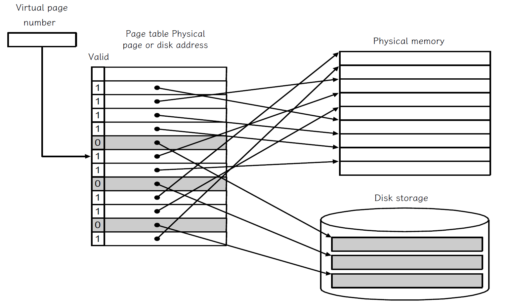
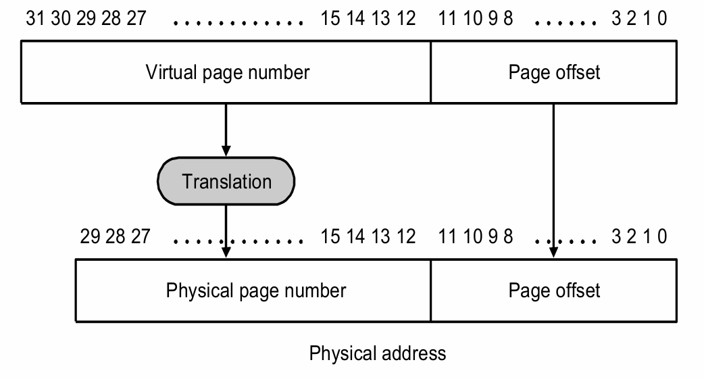
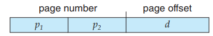
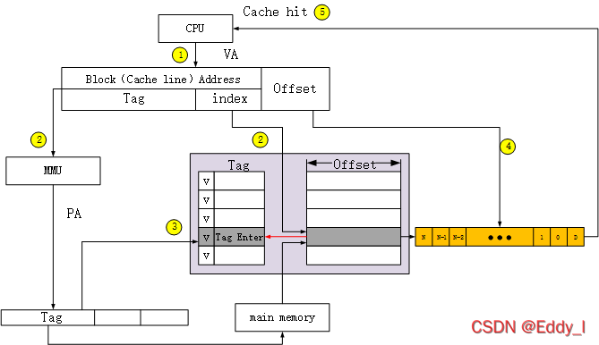

<div class="middle center">
<div style="width: 100%">

# HomeWork 5.17 - 5.20

Computer Organization(Spring 2024)

<hr/>

By [金杰鹏](https://github.com/JiepengLab)

[https://slide.jiepeng.tech/CO5](https://slide.jiepeng.tech/CO5)

</div>
</div>

<!-- s -->


<div class="middle center">
<div style="width: 100%">

# 5.17 Page Table 那些事

</div>
</div>


<!-- v -->

## 5.17.1

There are several parameters that affect the overall size of the page table. Listed below are key page table parameters.

| Virtual Address Size | Page Size |Page Table Entry Size |
|:--:|:--:|:--:|
|32 bits| 8 KiB|4 bytes|

<div class="fragment">

**[5.17.1]** Given the parameters shown above, calculate the maximum 
possible page table size for a system running five processes.
</div>
<!-- v -->

## 5.17.1 Page Table

Page Table: Virtual to physical address

<div class="fragment">


</div>

<!-- v -->
## 5.17 Page Table

计算每个进程的 Page Table 的大小：条目个数*条目大小

<div class="fragment">

$
\begin{aligned}
\text{Page Size} &= 8 KiB = 2^{13} B \\\\
条目个数 &= \frac{\text{Virtual Address Size}}{\text{Page Size}}  \frac{2^{32}}{2^{13}}=2^{19}
\end{aligned}
$

</div>

<div class="fragment">

<div style="text-align: center;">
    
</div>

</div>

<div class="fragment">

图中的 Page offset 应是 13 位
</div>

<!-- v -->

## 5.17.1 Page Table

| Virtual Address Size | Page Size |Page Table Entry Size |
|:--:|:--:|:--:|
|32 bits| 8 KiB|4 bytes|

<div class="fragment">

计算每个进程的 Page Table 的大小：
</div>

<div class="fragment">

$条目个数*条目大小 = 2^{19}*4\text{bytes}=2^{21} \text{bytes}$
</div>

<div class="fragment">

对于 5 个进程，Page Table 的大小为：
</div>

<div class="fragment">

$5*2^{21} \text{bytes}=10MiB$
</div>

<!-- v -->
## 5.17.2 Two-level page table 

| Virtual Address Size | Page Size |Page Table Entry Size |
|:--:|:--:|:--:|
|32 bits| 8 KiB|4 bytes|

<div class="fragment">

**[5.17.2]** Given the parameters shown above, calculate the total page 
table size for a system running five applications that each utilize half of the virtual 
memory available, given a two-level page table approach with up to 256 entries 
at the 1st level. Assume each entry of the main page table is 6 bytes. Calculate the 
minimum and maximum amount of memory required for this page table.
</div>

<!-- v -->

## 5.17.2 Minimum

<div class="fragment">

二级页表：第一级页表的条目指向第二级页表，第二级页表的条目指向物理页

</div>

<div class="fragment">

题目告诉我们第一级最多有$256=2^8\ \ \ \ $个条目。那么每个第二级页面表包含$2^{(19 - 8)} = 2^{11}=2048\ \ \ \ \ \ \ \ \ $个条目。如下图：$p_1=8,p_2=11,d=13$

</div>

<div class="fragment">

<div style="text-align: center;">
    
</div>
</div>

<div class="fragment">

- 第二个页面的大小为$2^{11}*4=8KiB$

</div>

<div class="fragment">

<!-- v -->

## 5.17.2 Minimum

<div class="fragment">

第二个页面覆盖了$2^{11}\times 2^{13}=2^{24}\ \ \ \ \ \ $个字节的虚拟地址空间。

</div>

<div class="fragment">


题目说每个应用程序都利用了一半的可用虚拟内存。所以每个应用程序的虚拟地址空间大小为$2^{32-1}=2^{31}$

</div>

<div class="fragment">


我们最小需要$5\times 2^{31}/2^{24}=5\times 2^7\ \ \ \ \ \ \ \ \ \ \ \ $个第二级页面表，

</div>

<div class="fragment">

所以第一级页面表的大小为$5\times 2^7\times 6=3840\text{B}$

</div>

<div class="fragment">

第二级页面表的大小为$5\times 2^7\times 8KiB=5120KiB=5MiB$
</div>

<div class="fragment">

所以最小情况下，页表的大小为$3840B+5MiB$
</div>

<!-- v -->

## 5.17.2 Maximum

第二个页面覆盖了$2^{11}\times 2^{13}=2^{24}\ \ \ \ \ \ $个字节的虚拟地址空间。

题目说每个应用程序都利用了一半的可用虚拟内存。所以每个应用程序的虚拟地址空间大小为$2^{32-1}=2^{31}$

<div class="fragment">

如果程序优化得不好，我们需要用到所有第二级页面表，即二级表的个数为$5\times 2^8\ \ $个，
</div>

<div class="fragment">

- 第一级页面表的大小为$5\times 2^8\times 6=7680\text{B}$
- 第二级页面表的大小为$5\times 2^8\times 8KiB=5120KiB=10MiB$

</div>

<div class="fragment">

所以最大情况下，页表的大小为$7680B+10MiB$

</div>

<!-- v -->

## **5.17.3**

**[5.17.3]** A cache designer wants to increase the size of a 4 KiB virtually 
indexed, physically tagged cache. Given the page size shown above, is it possible to 
make a 16 KiB direct-mapped cache, assuming two 64-bit words per block? How 
would the designer increase the data size of the cache?


<div class="fragment">

物理标记的虚拟高速缓存 VIPT（Virtually-Indexed Physically-Tagged），使用虚拟地址做 index ，物理地址做 Tag。
</div>

<!-- v -->

## 物理标记的虚拟高速缓存 VIPT

<div class="fragment">

在使用虚拟存储器的系统中，物理标记的虚拟高速缓存VIPT 使用虚拟地址做 index ，物理地址做 Tag。在利用虚拟地址索引 Cache 的同时利用 TLB/MMU 将虚拟地址转换为物理地址。然后将转换后的物理地址与虚拟地址索引到的 Cache line 中的 Tag 作比较，如果匹配则命中。
</div>

<div class="fragment">


</div>

<!-- v -->

<div class="fragment">

一个16KiB的直接映射缓存，如果每个块包含两个64-bit words，即16Bytes
</div>

<div class="fragment">

因此16KiB/16B = 1024个块。
</div>

<div class="fragment">

因此，它将有10位索引位和4位偏移位.
</div>

<div class="fragment">

我们要增加一个4KiB的 Cache ，这意味着我们可以用的位数只有12位。
</div>

<div class="fragment">

因为$14>12\ \ \ \ $，所以索引将超出我们可以用的位数范围。
</div>

<div class="fragment">

In Solution, 用了page offset的13位作比较。觉得它是想把index写到page offset里面？
</div>


<div class="fragment">

所以我们要想办法把这个索引的数目减下来。设计师可以通过增加缓存的关联性来增加缓存的数据大小。这将减少索引位数，使得缓存的索引能够完全包含在页面索引内。
</div>
<!-- s -->

<div class="middle center">
<div style="width: 100%">

# 5.20 Replacement Policies 那些事

</div>
</div>

<!-- v -->

## 5.20

In this exercise, we will examine how replacement policies affect miss rate. 
Assume a **two-way** set associative cache with **four one-word blocks**. 

Consider the following word address sequence: 

```
0, 1, 2, 3, 4, 2, 3, 4, 5, 6, 7, 0, 1, 2, 3, 4, 5, 6, 7, 0.
```

Consider the following address sequence: 

```
0, 2, 4, 8, 10, 12, 14, 16, 0
```

1. The LRU replacement policy.
2. The MRU replacement policy.

<!-- v -->

## 5.20.1 LRU replacement 

<div class="fragment">


```
0, 1, 2, 3, 4, 2, 3, 4, 5, 6, 7, 0, 1, 2, 3, 4, 5, 6, 7, 0.
```

</div>

<div class="fragment">

```c [1|2|3|4|5|6|7|8|9|10|11|12|13|14|15|16|17]
[**0, 1| *2, 3]         //插入0,1,2,3
0, [*1, 4| **2, 3]      //插入4
0, [**1, 4| *3, 2]      //插入2，2-hit!
0, [**1, 4| *2, 3]      //插入3，3-hit!
0, [*1, 4| **2, 3]      //插入4，4-hit!
0, 2, [**1, 4| *3, 5]           //插入5
0, 2, 1, [*4, 6| **5, 3]        //插入6
0, 2, 1, 5, [**4, 6| *3, 7]     //插入7
0, 2, 1, 5, 4, [*6, 0| **3, 7]          //插入0
0, 2, 1, 5, 4, 3, [**6, 0| *7, 1]       //插入1
0, 2, 1, 5, 4, 3, 6, [*0, 2| **7, 1]    //插入2
0, 2, 1, 5, 4, 3, 6, 7, [**0, 2| *1, 3] //插入3
0, 2, 1, 5, 4, 3, 6, 7, 0, [*2, 4| **1, 3]  //插入4
0, 2, 1, 5, 4, 3, 6, 7, 0, 1, [**2, 4| 3, 5]  //插入5
0, 2, 1, 5, 4, 3, 6, 7, 0, 1, 2, [*4, 6| **3, 5]  //插入6
0, 2, 1, 5, 4, 3, 6, 7, 0, 1, 2, 3, [**4, 6| *5, 7]  //插入7
0, 2, 1, 5, 4, 3, 6, 7, 0, 1, 2, 3, 4, [*6, 0| **5, 7]  //插入0
```

</div>

<!-- v -->

## 5.20.2 MRU (most recently used)

<div class="fragment">

```
0, 1, 2, 3, 4, 2, 3, 4, 5, 6, 7, 0, 1, 2, 3, 4, 5, 6, 7, 0.
```

</div>

<div class="fragment">

```c [1|2|3|4|5|6|7|8|9|10|11|12|13|14|15|16|17]
[0, 1*| 2, 3**]
3, [0, 1*| 2, 4**]
3, [0, 1*| 4, 2**]     //2-hit!
3, 2, [0, 1*| 4, 3**]
3, 2, [0, 1*| 3, 4**]     //4-hit!
3, 2, 4, [0, 1*| 3, 5**]
3, 2, 4, 5, [0, 1*| 3, 6**]
3, 2, 4, 5, 6, [0, 1*| 3, 7**]
3, 2, 4, 5, 6, [1, 0**|3, 7*]    //0-hit!
3, 2, 4, 5, 6, [0, 1**|3, 7*]    //1-hit!
3, 2, 4, 5, 6, 1, [0, 2**| 3, 7*]
3, 2, 4, 5, 6, 1, [0, 2*| 7, 3**]    //3-hit!
3, 2, 4, 5, 6, 1, 3, [0, 2*| 7, 4**]
3, 2, 4, 5, 6, 1, 3, 4, [0, 2*| 7, 5**]
3, 2, 4, 5, 6, 1, 3, 4, 5, [0, 2*| 7, 6**]
3, 2, 4, 5, 6, 1, 3, 4, 5, [0, 2*,| 6, 7**]    //7-hit!
3, 2, 4, 5, 6, 1, 3, 4, 5, [2, 0**,| 6, 7*]    //0-hit!
```

</div>

<!-- v -->

## 5.20.3 Random replacement policy

<div class="fragment">
Simulate a random replacement policy by flipping a coin. 
For example, “heads” means to evict the first block in a set and “tails” means to 
evict the second block in a set. How many hits does this address sequence exhibit?
</div>

<div class="fragment">

伟大的随机替换策略！每次运行的结果都不一样！
</div>

<!-- v -->

##  5.20.4
<div class="fragment">

Describe an optimal replacement policy for this 
sequence. Which accesses are hits using this policy?
</div>

<div class="fragment">

对于序列

```
0, 1, 2, 3, 4, 2, 3, 4, 5, 6, 7, 0, 1, 2, 3, 4, 5, 6, 7, 0.
```
</div>

<div class="fragment">

最佳替换策略是 MRU，因为它可以最大程度地减少缓存未命中。
</div>

<!-- v -->

## 5.20.5 

<div class="fragment">


Describe why it is difficult to implement a cache 
replacement policy that is optimal for all address sequences.
</div>

<div class="fragment">

因为不同的访问序列可能会导致不同的替换策略是最优的。对于某些倾向于访问新数据的序列，LRU把访问时间最旧的淘汰掉，可能是最佳策略；而对于另一些倾向于访问旧数据的序列，MRU把访问时间最新的淘汰掉 可能是最佳策略。


</div>

<div class="fragment">

缓存控制器无法预知未来！我们最好的替代方案是做出一个准确的预测。
</div>

<div class="fragment">

<!-- v -->

##  5.20.6
<div class="fragment">

Assume you could make a decision upon each memory 
reference whether or not you want the requested address to be cached. What effect 
could this have on miss rate?
</div>

<div class="fragment">

如果我们知道某个地址的时间局部性有限，并且会与缓存中的另一个块发生冲突，选择不缓存它可能会提高缓存的未命中率。另一方面，如果选择不当，决定哪些地址要缓存，可能会降低缓存的未命中率。
</div>

<div class="middle center">
<div style="width: 100%">

# 复习

</div>
</div>

<!-- v -->

第一章 

1. CPI
2. 