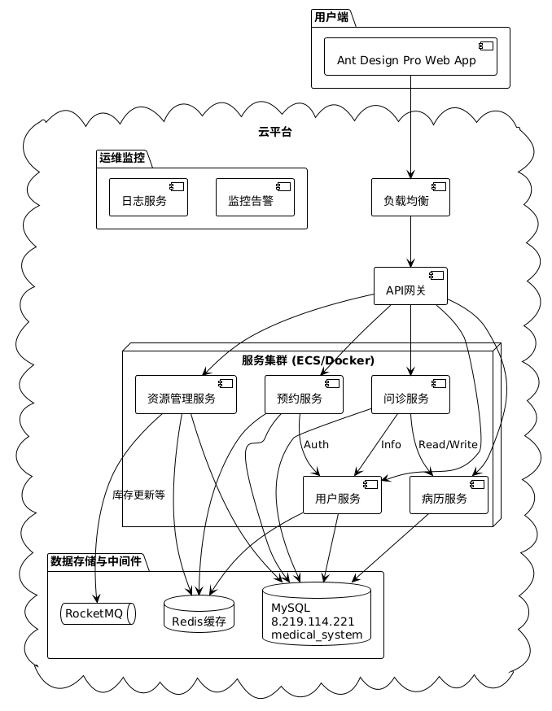
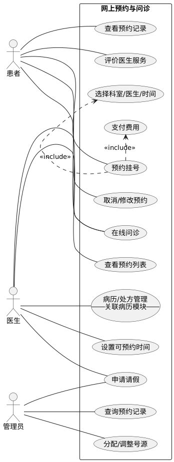
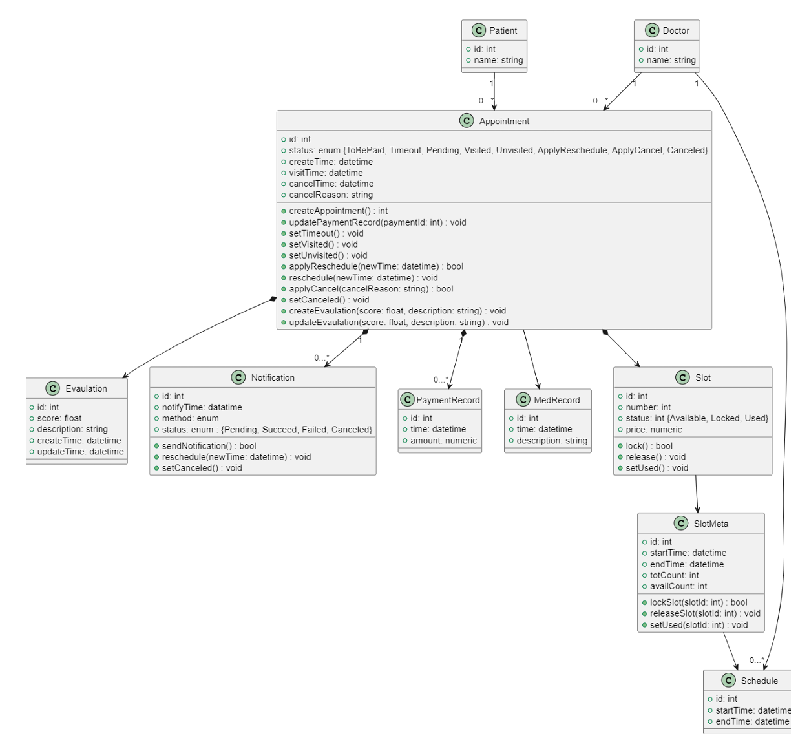

# 软件工程课程项目

**项目名称：** 综合医院信息管理系统

**小组：** 第四大组

**日期：** 2025年4月

<!-- s -->

# Part.1 项目概述与需求分析

<!-- v -->

## 1.1 项目背景与目标

**背景:**

* 传统医疗服务模式在资源配置、患者体验、管理效率等方面存在挑战 (**信息孤岛**, **流程繁琐**, **资源浪费**)。(类似 Ch.1 Case 1 Brooks提及的大系统复杂性问题)
* 信息技术发展 (数字化、智能化) 为医疗行业转型提供了契机。(对应 Ch.1 Software Evolution & Changing Nature of Software)
* 现有系统不足：部分医院系统功能基础，缺乏深度整合与智能分析；小型机构系统缺失。(Legacy Software 需要 Enhance/Extend - Ch.1.1)

**项目目标:**

* 开发一套集成化、数字化、智能化的医院信息管理系统。(目标是提供Value to users - Ch.2.3 General Principle 1)
* 提升医疗服务效率与质量，优化患者就医体验。
* 实现医疗资源的精细化管理与优化配置。
* 为医院管理层提供数据驱动的决策支持。

<!-- v -->

## 1.2.1 用户需求分析

**核心用户角色 & 需求痛点:** (对应课堂 Ch.8 Inception - Identify stakeholders)

* **患者:**
    * **需求:** 便捷预约、减少排队、远程问诊、清晰了解病情与费用、个人健康信息管理、隐私保护。
    * **痛点:** 挂号难、排队长、复诊不便、信息不透明。
* **医生/医护人员:**
    * **需求:** 高效管理患者病历、合理安排工作时间 (排班/问诊)、便捷查看患者预约、安全合规操作、跨科室协作。
    * **痛点:** 病历查找/书写耗时、排班冲突、信息获取不便、资源（药品/设备）管理繁琐。

<!-- v -->

## 1.2.1 用户需求分析 (续)

* **医院管理员 (包括各科室主任/财务等):**
    * **需求:** 统一管理用户权限、监控系统运行、管理医疗资源 (号源、排班、药品、设备、床位、财务)、审计操作、数据统计分析。
    * **痛点:** 资源调度难、权限管理复杂、缺乏有效监管和数据支持、成本控制难。

<!-- v -->

## 1.2.2 需求分析细节

* **场景分析 (Use Cases - Ch.8.3/9):** 细化了如“患者首次预约 (Primary Scenario)”、 “预约时号源已被占用 (Alternative Interaction)” 、“医生处理请假”、“管理员分配号源”、“药剂科入库”、“设备科维护”等具体场景。
* **需求获取 (Elicitation - Ch.8.2):** 通过分析现有系统痛点、结合小组讨论和模拟用户场景进行需求挖掘。
* **优先级划分:** 区分核心需求 (Must Have) 和辅助需求 (Nice to Have)，并根据用户角色确定优先级。(类似 Ch.8 QFD中的Value Analysis)
* **数据驱动:** 强调数据记录与分析需求，为管理决策提供依据。
* **挑战识别:** 识别到可能的范围蔓延 (Scope)、需求理解偏差 (Understanding)、需求变更 (Volatility) 风险，需要在开发中持续管理。(Ch.8.2 Eliciting Requirements - Problems)

<!-- v -->

## 1.3 功能性需求

**核心模块:**

1. **用户管理子系统:** 负责多角色用户 (患者、医生、管理员) 的认证、权限管理。
2. **在线问诊子系统:** 提供远程图文/视频问诊、医患沟通功能。
3. **病历管理子系统:** 实现电子病历的创建、存储、查询、更新、共享。
4. **网上预约子系统:** 管理号源分配、患者预约、排班信息。
5. **资源管理子系统:** 管理药品、设备、病房床位、排班、财务等。
<!-- v -->

## 1.3 功能性需求 (核心概览)

| 模块名称| 核心功能| 关键点/约束 |
| :-----------: | :---------: | :--------: |
| **用户管理**     | 账户创建/登录/信息更新/删除, 角色权限控制 (Admin, Doctor, Patient) | 用户名唯一性, 密码复杂度, JWT/Token认证, 权限分离  |
| **在线问诊**     | 预约/选择医生, 图文/视频沟通, 电子处方, 病历调阅, 服务评价     | 实时通讯, 病历集成, 处方合规性, 隐私保护  |
| **病历管理**     | 病历创建/查询/更新/删除/共享, 版本控制, 结构化存储             | ICD编码, 模板化书写, 操作追溯, 权限控制 (患者仅看自己,医生分级)       |

<!-- v -->

## 1.3 功能性需求 (核心概览)

| 模块名称| 核心功能| 关键点/约束 |
| :-----------: | :---------: | :--------: |
| **网上预约**     | 查看号源/科室/医生, 预约/取消/修改, 支付, 评价, 提醒        | 号源实时同步, 冲突检测, 支付集成, 消息通知       |
| **资源管理**     | (药品) 库存/效期/批次管理, (设备) 维护/状态跟踪, (病房) 床位分配/状态, (人员) 排班管理, (财务) 成本核算 | 溯源, 预警, 可视化, 负载均衡, 冲突检测, 财务关联, 合规审计         |

*这些功能需求构成了系统 **Scope** (Ch.8.2)*

<!-- v -->

## 1.4 非功能性需求 (NFRs - Ch.8.2)

* **性能 (Performance):** (Ch.19.2 Quality Dimension)
    * **响应时间:** 关键操作 < 2-5秒。
    * **吞吐量:** 支持高峰期并发用户数 (目标 >1000 QPS 核心接口)。
    * **资源利用:** CPU < 80%, 内存 < 85%。
* **安全性 (Security):** (Ch.19.2 Quality Dimension)
    * 数据加密 (传输/存储), 强身份认证, 细粒度权限控制, 操作审计, 防注入/跨站攻击, 隐私保护 (符合《个人信息保护法》等)。

<!-- v -->

## 1.4 非功能性需求 (续)

* **可用性 & 可靠性 (Availability & Reliability):** (Ch.19.2 Quality Dimension, Ch.21.7 Reliability)
    * 界面简洁直观 (基于 Ant Design 规范), 操作便捷, 跨浏览器/多终端兼容, 高可用性 (>99.9%), 故障自动恢复/冗余设计。
* **可维护性 & 可扩展性 (Maintainability & Scalability):** (Ch.19.2 Quality Dimension)
    * 微服务/模块化设计, 代码规范, 清晰的接口文档 (Apifox), 日志完善, 支持功能迭代与第三方集成。(支持 Legacy Software 演进 - Ch.1.1)
* **开发效率:**
    * 选用成熟框架 (Ant Design Pro) 降低前端学习和开发成本，提供最佳实践和可复用组件。(考虑 Human Factors - Ch.6)

<!-- s -->

# Part.2 系统设计

<!-- v -->

## 2.1 设计方法与原则

**设计方法:** (课堂 Ch.2.1 Layered Technology, Ch.9-12)

* **面向对象分析与设计 (OOAD):** 采用类、对象、继承、多态等概念进行建模。(Ch.10)
* **统一建模语言 (UML):** 使用多种 UML 图进行可视化设计 (用例图, 类图, 状态图, 数据流图等)。(Analysis/Design Modeling - Ch.9-11)
* **CRC 卡 (Class-Responsibility-Collaboration):** 用于识别类的职责和协作关系 (见各组报告)。(Ch.10.3)

**设计原则:** (课堂 Ch.7 Principles that Guide Practice, Ch.12 Design Concepts)

* **模块化/微服务化 (Modularity):** 将系统按业务领域划分为独立的、高内聚、低耦合的服务/模块。(Ch.7 Principle #5, Ch.12.3)
* **分层 (Layered):** 在各服务内部或整体架构中采用分层思想 (表示层、业务逻辑层、数据访问层)。(Ch.13.2 Architectural Style)

<!-- v -->

## 2.1 设计方法与原则 (续)

**设计原则(续):**

* **接口驱动 (Interface Design):** 定义清晰、稳定的服务间 API 接口 (使用 RESTful 风格)。(Ch.7 Principle #4, Ch.12.2, Ch.15)
* **信息隐藏/封装 (Information Hiding/Encapsulation):** 通过接口暴露必要信息，隐藏内部实现细节。(Ch.10.1, Ch.12.3)
* **关注点分离 (Separation of Concerns - SoC):** 将不同职责分离到不同模块/类。(Ch.7 Principle #1, Ch.12.3)
* **数据一致性:** 在分布式环境下考虑数据一致性策略。
* **安全性:** 在设计阶段充分考虑认证、授权、数据加密和访问控制。
* **用户中心:** 遵循 Ant Design 设计规范，提供一致且高效的用户体验。(Golden Rules - Ch.15.1)
* **KISS (Keep It Simple, Stupid!):** 避免过度设计。(Ch.2.3 General Principle 2)

<!-- v -->

## 2.2 系统架构设计

**采用前后端分离的微服务架构:** (符合 Modularity, SoC 原则 - Ch.12.3)

**逻辑架构:** (类似 Ch.13.2 Layered Architecture 概念，但应用于服务层面)

1. **表示层 (前端):**
    * **框架:** **Ant Design Pro** (基于 React, 集成 Umi 框架和 Ant Design 组件库)
        * *选择理由:* 提供企业级最佳实践，内置布局/列表等组件，显著降低开发成本和学习曲线；Ant Design Vue 版本较旧。(考虑开发效率和团队技能 - Human Factors Ch.6)
        * *参考:* [Pro Docs](https://pro.ant.design/zh-CN/docs/getting-started), [Ant Design Spec](https://ant-design.antgroup.com/docs/spec/introduce-cn)

<!-- v -->

## 2.2 系统架构设计(续 1)

2. **应用层 (后端 - 微服务):** (每个服务可视为一个 Component - Ch.14.1)
    * **API 网关:** 统一认证、路由、限流、熔断。(类似 Broker Pattern - Ch.13.3)
    * **核心业务服务 (通过 Git Submodule 管理):**
        * 用户服务, 预约服务, 问诊服务, 病历服务, 资源管理服务
    * **技术栈:** Java/Spring Boot 或 Python/Django...
<!-- v -->

## 2.2 系统架构设计(续 2)

3. **数据层:**
    * **数据库:** **MySQL 8.0+**
        * *Schema:* 已设计并部署，重点考虑了外键关联。(Data/Class Design - Ch.12.2)
        * *文档:* **[dbdocs.io Online Wiki](https://dbdocs.io/1978264748/E_Health)**
    * **缓存:** Redis (用于提升性能 - Persistence Pattern 辅助 - Ch.13.3)
    * **消息队列:** RocketMQ (用于异步处理，解耦，提高可靠性 - 可能涉及 Concurrency/Distribution Patterns - Ch.13.3)
4. **基础设施:**
    * 云服务器 (ECS)
    * 日志/监控服务

<!-- v -->

## 2.2 系统架构设计(续 3)

**物理部署/交互 (示意):** (Deployment Model Element - Ch.12.2)

<!-- v -->

## 2.3 UML 设计展示 (精选)

**用例图 (Use Case Diagram - Ch.8.3/9):** *(示例: 预约与问诊核心流程)*

**类图 (Class Diagram - Ch.10):** *(示例: 预约与问诊核心类)*

**详细 Schema & 外键:** **[dbdocs.io](https://dbdocs.io/1978264748/E_Health)**

<!-- v -->

## 2.4 接口与组件设计

**接口设计 (API - RESTful):** (对应 Interface Design - Ch.12.2/15)

* **原则:** 使用标准 HTTP 方法, 面向资源设计 URL, 使用 JSON。(Consistency Principle - Ch.7.2)
* **示例 (部分核心接口):**
    * `POST /api/auth/login`
    * `GET /api/appointments?patientId={id}`
    * `POST /api/appointments`
    * `GET /api/records?patientId={id}`
    * `POST /api/records`
    * `POST /api/resource/medicines/stock-in` (药品入库)
    * `GET /api/resource/equipments/{id}/maintenance` (查设备维护记录)
* **API 文档:** **[Apifox Wiki](https://cbfs62hkmj.apifox.cn/)** (包含详细数据模型) (Documentation as part of Software Configuration - Ch.2.2/5)

<!-- v -->

## 2.4 接口与组件设计(续)

**组件设计 (Component-Level Design - Ch.14):** (微服务/模块内部)

* **用户服务:** 认证、授权、用户档案管理组件。(High Cohesion, Low Coupling - Ch.12.3/14.2)
* **预约服务:** 号源查询、预约逻辑、状态机、通知组件。
* **问诊服务:** 通信管理、病历集成、处方校验、评价组件。
* **病历服务:** 病历CRUD、版本控制、权限管理、模板组件。
* **资源管理服务:** 库存、维护、床位、排班、财务等子组件。 (SoC Principle - Ch.7.2/12.3)

*设计考虑了职责分离，便于独立开发、部署和扩展。*

<!-- s -->

# Part.3 质量保证与项目管理

<!-- v -->

## 3.1 质量保证措施 (SQA - Ch.2.2/19/21)

**目标:** 确保系统功能正确、性能稳定、安全可靠、易于使用和维护。 (Focus on Quality at Every Step - Ch.7.1)

**主要措施** (Umbrella Activities - Ch.2.2):

* **需求评审/验证 (Requirements Validation - Ch.8.6):** 小组内部及大组间交叉评审需求报告，确保理解一致、无歧义、完整、可测试。
* **设计评审 (Design Review):** 对架构、数据库 Schema (dbdocs.io)、API 设计 (Apifox) 进行评审。(FTRs - Ch.20.6)
* **代码规范与审查 (Code Review):** 制定统一规范，成员间代码互审 (**通过 Pull Request 强制执行**)。(FTRs - Ch.20.6)

<!-- v -->

## 3.1 质量保证措施 (SQA - Ch.2.2/19/21)

**主要措施(续):**

* **版本/配置管理 (Configuration Management - Ch.2.2/17):** 使用 Git (git.zju.edu.cn) 进行代码版本管理和协作 (**见后页工作流**)。
* **自动化测试:** (Testing Principles - Ch.7.4/14.2)
    * 单元测试 (Unit Testing - Ch.14.2)
    * 集成测试 (Integration Testing)
    * API 功能/性能测试 (Apifox)
* **系统测试/功能测试:** 根据验证准则进行端到端功能验证。
* **用户验收测试 (UAT):** 邀请模拟用户进行实际操作测试。
* **文档管理:** 维护需求、设计(UML, DB Schema, API)、测试、用户手册等文档。(Documentation - Ch.5)

<!-- v -->

## 3.2 项目管理与协作 (Project Management - Ch.2.2)

**协作工具与平台:** (Tools layer in SE - Ch.2.1)

* **主要沟通与管理平台:** **钉钉 (DingTalk)**
    * 用于群组沟通、通知发布、文件共享。(Communication Principles - Ch.7.3)
    * **项目任务管理:** 利用钉钉项目或类似功能，创建 **多维表** 跟踪 **任务、截止日期、负责人、附件链接、完成情况**。(Project Tracking and Control - Ch.2.2)
* **代码托管 & 版本控制:** ZJU Git (`git.zju.edu.cn`)
* **API 设计/文档/测试:** Apifox ([文档](https://cbfs62hkmj.apifox.cn/))
* **数据库 Schema 文档:** dbdocs.io ([E_Health Schema](https://dbdocs.io/1978264748/E_Health))

<!-- v -->

## 3.2 项目管理与协作 (续)

**项目会议 & 计划 (Planning - Ch.2.2/7.2):**

* **会议:** (Communication Principles - Ch.7.3)
    * **定期:** 小组内部周会，大组协调会 (已召开两次)。
    * **不定期:** 技术攻关、设计评审、需求变更讨论。
    * **记录:** 重要会议进行记录与追踪。

**代码版本控制与工作流 (Git & Submodules):** (Configuration Management - Ch.2.2/17)

* **仓库结构:** 主仓库 (`E-Health`) + 各子系统作为 **Git Submodules** (`systems/*`)。
* **分支策略:** `main`(生产), `dev`(开发), `feat/*`, `fix/*` (工作)。`main` 和 `dev` 受保护。
<!-- v -->

## 3.2 项目管理与协作 (续)

**当前状态与下一步:**

* **需求:** 各小组需求报告完成。(End of Requirements Engineering Phase - roughly)
* **设计:** 整体数据库 Schema 已设计部署；API 在 Apifox 中部分定义；架构已初步确定。(Modeling/Design Phase)
* **开发:** 前端框架搭建完毕；后端已开始开发；数据库已可用。(Transition to Construction Phase - Ch.2.2)
* **下一步:** **按计划并行开发 (遵循 Git 工作流)** -> 集成测试。

<!-- s -->

# 总结与 Q&A

<!-- v -->

## 总结

* **需求分析:** 遵循 **Requirements Engineering** 流程思想(Ch.8)，深入分析了用户需求，明确了系统功能与非功能要求，识别了潜在挑战。
* **系统设计:** 采用 **OOAD** 和 **UML**(Ch.9-12)，确定了前后端分离的微服务架构，应用了 **分层**、**模块化**、**SoC**、**信息隐藏** 等设计原则(Ch.7/12/13)；选定了具体技术栈 (AntD Pro, MySQL, Redis, MQ)；完成了数据库 Schema 初步设计与部署；使用 **Apifox** 和 **dbdocs.io** 进行设计协作与文档化。
* **质量与管理:** 建立了包含 **评审(FTRs)**(Ch.20)、**测试**(Ch.7/14)、**规范的 Git 工作流 (含 Submodule 和 PR)**(Ch.2/17 CM) 的 **SQA** 措施(Ch.21)；使用 **钉钉** 进行项目计划跟踪和沟通；明确了项目时间表和协作工具(Ch.2 PM)。

<!-- v -->

## 总结 (续)

**关键技术选型与决策:**

* **前端 Ant Design Pro:** 降低开发门槛，提升 **可用性** 和 **一致性** (Ch.15 UI Design)。
* **数据库 Schema 优先设计:** 保证 **数据设计** 的重要性 (Ch.12 Data Design)。
* **微服务 & Git Submodules:** 实现 **模块化** 和 **关注点分离** (Ch.12 Modularity, SoC)，便于 **演化** (Ch.4 Evolutionary Models)。
* **受保护分支 + Pull Request:** 强制 **代码审查**，提升 **质量** (Ch.20)。
* **在线协作工具:** 促进 **沟通** 与 **协作** (Ch.7 Communication Principles, Ch.6 Collaboration)，支持 **项目管理** (Ch.2)。

<!-- v -->

# Q & A

**Thank You!**

