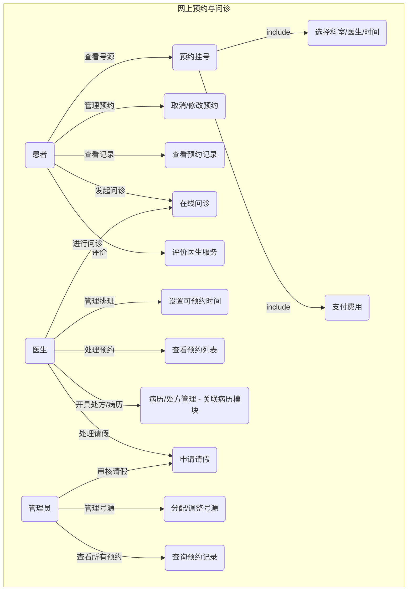
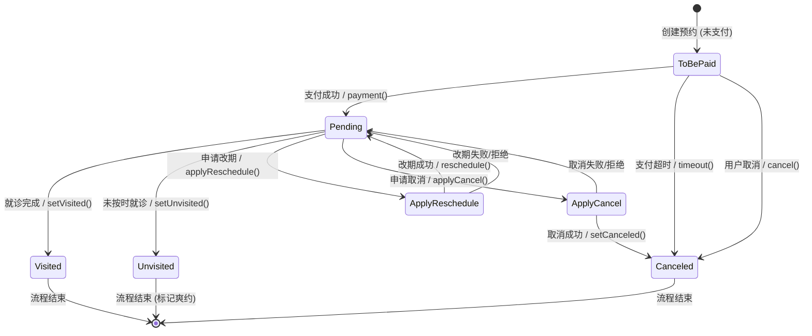

<div class="middle center">
<div style="width: 100%">

# 软件工程课程项目

<hr/>

**项目名称：** 综合医院信息管理系统

**小组：** 第四大组

**日期：** 2025年4月

</div>
</div>

<!-- s -->

<div class="middle center">
<div style="width: 100%">

# Part.1 项目概述与需求分析

</div>
</div>

<!-- v -->

## 1.1 项目背景与目标

**背景:**

* 传统医疗服务模式在资源配置、患者体验、管理效率等方面存在挑战 (信息孤岛, 流程繁琐, 资源浪费)。
* 信息技术发展 (数字化、智能化) 为医疗行业转型提供了契机。
* 现有系统不足：部分医院系统功能基础，缺乏深度整合与智能分析；小型机构系统缺失。

**项目目标:**

* 开发一套集成化、数字化、智能化的医院信息管理系统。
* 提升医疗服务效率与质量，优化患者就医体验。
* 实现医疗资源的精细化管理与优化配置。
* 为医院管理层提供数据驱动的决策支持。

<!-- v -->

## 1.1 项目背景与目标

**核心模块:**

1. **用户管理子系统:** 负责多角色用户 (患者、医生、管理员) 的认证、权限管理。
2. **在线问诊子系统:** 提供远程图文/视频问诊、医患沟通功能。
3. **病历管理子系统:** 实现电子病历的创建、存储、查询、更新、共享。
4. **网上预约子系统:** 管理号源分配、患者预约、排班信息。
5. **资源管理子系统:** 管理药品、设备、病房床位、排班、财务等。

<!-- v -->

## 1.2 用户需求分析

**核心用户角色 & 需求痛点:**

* **患者:**
    * **需求:** 便捷预约、减少排队、远程问诊、清晰了解病情与费用、个人健康信息管理、隐私保护。
    * **痛点:** 挂号难、排队长、复诊不便、信息不透明。
* **医生/医护人员:**
    * **需求:** 高效管理患者病历、合理安排工作时间 (排班/问诊)、便捷查看患者预约、安全合规操作、跨科室协作。(综合报告 3 Sec 2.3, 报告 4 Sec 1.3.2.2, 报告 5 Sec 3.2)
    * **痛点:** 病历查找/书写耗时、排班冲突、信息获取不便、资源（药品/设备）管理繁琐。
* **医院管理员 (包括各科室主任/财务等):**
    * **需求:** 统一管理用户权限、监控系统运行、管理医疗资源 (号源、排班、药品、设备、床位、财务)、审计操作、数据统计分析。(综合报告 1 Sec 3.2, 报告 4 Sec 1.3.2.3, 报告 5 Sec 3.2)
    * **痛点:** 资源调度难、权限管理复杂、缺乏有效监管和数据支持、成本控制难。

**需求分析细节 (课堂知识点体现):**

* **场景分析:** 细化了如“患者首次预约”、“医生处理请假”、“管理员分配号源”、“药剂科入库”、“设备科维护”等具体场景 (参考各报告用例 Sec 4.1)。
* **优先级划分:** 区分核心需求 (如登录、预约、病历查看、库存管理) 和辅助需求 (如评价、高级查询)，并根据用户角色确定优先级 (参考报告 1 Sec 3.2 表2, 报告 4 Sec 3.2, 报告 5 表 2)。
* **数据驱动:** 强调了数据记录与分析需求，如预约记录分析、资源使用率统计、成本核算，为管理决策提供依据。

<!-- v -->

## 1.3 功能性需求 (核心概览)

| 模块             | 核心功能                                                     | 关键点/约束                                                        |
| :--------------- | :----------------------------------------------------------- | :----------------------------------------------------------------- |
| **用户管理**     | 账户创建/登录/信息更新/删除, 角色权限控制 (Admin, Doctor, Patient) | 用户名唯一性, 密码复杂度, JWT/Token认证, 权限分离                   |
| **在线问诊**     | 预约/选择医生, 图文/视频沟通, 电子处方, 病历调阅, 服务评价     | 实时通讯, 病历集成, 处方合规性, 隐私保护                           |
| **病历管理**     | 病历创建/查询/更新/删除/共享, 版本控制, 结构化存储             | ICD编码, 模板化书写, 操作追溯, 权限控制 (患者仅看自己,医生分级)       |
| **网上预约**     | 查看号源/科室/医生, 预约/取消/修改, 支付, 评价, 提醒        | 号源实时同步, 冲突检测, 支付集成, 消息通知                         |
| **资源管理**     | (药品) 库存/效期/批次管理, (设备) 维护/状态跟踪, (病房) 床位分配/状态, (人员) 排班管理, (财务) 成本核算 | 溯源, 预警, 可视化, 负载均衡, 冲突检测, 财务关联, 合规审计         |

*参考来源: 各报告 Section 3.1 及核心功能描述*

<!-- v -->

## 1.4 非功能性需求

* **性能:**
    * **响应时间:** 关键操作 (查询、提交) < 2-5秒 (不同模块要求略有差异)。
    * **吞吐量:** 支持高峰期并发用户数 (e.g., 500-2000+ QPS, 视模块而定), 处理高频事务。
    * **资源利用:** CPU < 80%, 内存 < 85%。
* **安全性:**
    * 数据加密 (传输/存储), 强身份认证, 细粒度权限控制, 操作审计, 防注入/跨站攻击, 隐私保护 (符合《个人信息保护法》等)。
* **可用性 & 可靠性:**
    * 界面简洁直观 (基于 Ant Design 规范), 操作便捷, 跨浏览器/多终端兼容, 高可用性 (>99.9%), 故障自动恢复/冗余设计。
* **可维护性 & 可扩展性:**
    * 微服务/模块化设计, 代码规范, 清晰的接口文档 (Apifox), 日志完善, 支持功能迭代与第三方集成。
* **开发效率:**
    * 选用成熟框架 (Ant Design Pro) 降低前端学习和开发成本，提供最佳实践和可复用组件。

*参考来源: 各报告性能指标/非功能需求章节 + 新增信息*

<!-- s -->

<div class="middle center">
<div style="width: 100%">

# Part.2 系统设计

</div>
</div>

<!-- v -->

## 2.1 设计方法与原则

**设计方法:**

* **面向对象分析与设计 (OOAD):** 采用类、对象、继承、多态等概念进行建模。
* **统一建模语言 (UML):** 使用多种 UML 图进行可视化设计 (用例图, 类图, 状态图, 数据流图等)。
* **CRC 卡 (Class-Responsibility-Collaboration):** 辅助识别类的职责和协作关系。

**设计原则:**

* **模块化/微服务化:** 将系统按业务领域划分为独立的、高内聚、低耦合的服务/模块。
* **分层:** 在各服务内部或整体架构中采用分层思想 (表示层、业务逻辑层、数据访问层)。
* **接口驱动:** 定义清晰、稳定的服务间 API 接口 (使用 RESTful 风格)。
* **数据一致性:** 在分布式环境下考虑数据一致性策略 (如最终一致性、事务消息 - RocketMQ)。
* **安全性:** 在设计阶段充分考虑认证、授权、数据加密和访问控制。
* **用户中心:** 遵循 Ant Design 设计规范，提供一致且高效的用户体验。

<!-- v -->

## 2.2 系统架构设计

**采用前后端分离的微服务架构:**

<div class="mul-cols">
<div class="col">

**逻辑架构:**

1. **表示层 (前端):**
    * **框架:** **Ant Design Pro** (基于 React, 集成 Umi 框架和 Ant Design 组件库)
        * *选择理由:* 提供企业级最佳实践，内置布局/列表等组件，显著降低开发成本和学习曲线；Ant Design Vue 版本较旧。
        * *参考:* [Pro Docs](https://pro.ant.design/zh-CN/docs/getting-started), [Ant Design Spec](https://ant-design.antgroup.com/docs/spec/introduce-cn)
    * *(状态: 框架搭建中，计划进行培训)*
2. **应用层 (后端 - 微服务):**
    * **API 网关:** (推荐) 统一认证、路由、限流、熔断。
    * **核心业务服务 (通过 Git Submodule 管理):**
        * 用户服务
        * 预约服务
        * 问诊服务
        * 病历服务
        * 资源管理服务
    * **技术栈:** Java/Spring Boot 或 Python/Django (根据各组报告选择)
    * *(状态: API已定义，可开始开发)*
3. **数据层:**
    * **数据库:** **MySQL 8.0+** (Hosted on Cloud Server: `8.219.114.221`, DB: `medical_system`, User: `zjuse`)
        * *Schema:* 已设计并部署，重点考虑了外键关联。
        * *文档:* **[dbdocs.io Online Wiki](https://dbdocs.io/1978264748/E_Health)**
    * **缓存:** Redis (用于热点数据缓存)
    * **消息队列:** RocketMQ (用于异步处理，如药品入库事务)
4. **基础设施:**
    * 云服务器 (ECS)
    * 容器化 (Docker - 推荐)
    * 日志/监控服务

</div>
<div class="col" style="font-size: 0.8em;">

**物理部署/交互 (示意):**

```mermaid
graph TD
    subgraph 用户端
        UI[Ant Design Pro Web App]
    end
    subgraph 云平台
        LB[负载均衡]
        APIGW[API网关]

        subgraph 服务集群 (ECS/Docker)
           S_User[用户服务]
           S_Appoint[预约服务]
           S_Consult[问诊服务]
           S_Record[病历服务]
           S_Resource[资源管理服务]
        end

        subgraph 数据存储与中间件
           MySQL_RDS[MySQL<br/>8.219.114.221<br/>medical_system]
           Redis_Cache[Redis缓存]
           MQ_Rocket[RocketMQ]
        end

         subgraph 运维监控
           Logging[日志服务]
           Monitoring[监控告警]
        end
    end

    UI --> LB
    LB --> APIGW
    APIGW --> S_User
    APIGW --> S_Appoint
    APIGW --> S_Consult
    APIGW --> S_Record
    APIGW --> S_Resource

    S_User --> MySQL_RDS
    S_User --> Redis_Cache
    S_Appoint --> MySQL_RDS
    S_Appoint --> Redis_Cache
    S_Appoint --> S_User -- Auth
    S_Consult --> MySQL_RDS
    S_Consult --> S_Record -- Read/Write
    S_Consult --> S_User -- Info
    S_Record --> MySQL_RDS
    S_Resource --> MySQL_RDS
    S_Resource --> Redis_Cache
    S_Resource --> MQ_Rocket -- 库存更新等

```

*注: 服务间调用关系仅为示例。*

</div>
</div>

*参考来源: 各报告技术栈 + 新增技术细节*

<!-- v -->

## 2.3 UML 设计展示 (精选)

<div class="mul-cols">
<div class="col">

**用例图 (示例: 预约与问诊核心流程)**



*示意图，综合报告2和报告4用例*

</div>
<div class="col" style="font-size: 0.9em;">

**类图 (核心实体关联 - 简化)**

```mermaid
classDiagram
    %% 主体类
    class Patient
    class Doctor
    class Admin
    class Appointment
    class MedicalRecord
    class Consultation % 在线问诊
    %% 预约相关
    class Slot
    class SlotMeta
    class Schedule
    %% 资源相关
    class Department
    class Medicine
    class Equipment
    class Ward
    class WardBed
    class MedicineStockIn
    class MaintenanceRecord
    class HospitalExpense
    class PaymentRecord

    %% 关系 (部分核心)
    Patient "1" -- "*" Appointment
    Doctor "1" -- "*" Appointment
    Patient "1" -- "*" MedicalRecord
    Doctor "1" -- "*" MedicalRecord
    Appointment "1" -- "1" Slot
    Slot "1" -- "1" SlotMeta
    SlotMeta "1" -- "1" Schedule
    Schedule "1" -- "1" Doctor
    Admin -- "*" Patient
    Admin -- "*" Doctor
    Doctor "1" -- "*" Department
    Ward "1" -- "*" WardBed
    Patient "1" -- "*" Consultation
    Doctor "1" -- "*" Consultation
    Consultation "1" .. "1" MedicalRecord : references/updates
    HospitalExpense "1" -- "1" PaymentRecord : relates to
    MedicineStockIn "1" -- "*" Medicine
    MaintenanceRecord "1" -- "1" Equipment
    MaintenanceRecord "1" -- "1" Doctor : performed by

```

*综合各组类图信息* <br/>
**详细 Schema & 外键:** **[dbdocs.io](https://dbdocs.io/1978264748/E_Health)**
</div>
</div>

<!-- v -->

## 2.4 UML 设计展示 (续)

<div class="mul-cols">
<div class="col">

**状态图 (示例: 预约 Appointment)**



*参考报告4状态图逻辑*
</div>

<div class="col">

**数据流图 (DFD - Level 0 示例: 核心交互)**

```mermaid
graph TD
    P[外部实体: 患者]
    D[外部实体: 医生]
    A[外部实体: 管理员]
    SP[外部实体: 供应商] % 新增
    S[处理: 医院信息系统<br/>(用户/预约/问诊/病历/资源)]
    DB[(数据存储: 综合数据库)]

    P -- 预约/问诊/信息查询 --> S
    S -- 确认/回复/病历/费用 --> P
    D -- 排班/诊疗/病历录入/维护 --> S
    S -- 预约列表/患者信息/工单 --> D
    A -- 用户管理/资源配置/规则/审计 --> S
    S -- 状态/报表/日志 --> A
    SP -- 药品/设备供货单 --> S % 新增
    S -- 采购订单/退货通知 --> SP % 新增

    S -- 读写 --> DB
```

*顶层视图，综合各模块交互，增加了供应商*

</div>
</div>
*注：CRC卡在报告中有体现 (如报告1 Sec 4.4, 报告5 Sec 4.4)，用于细化类职责，此处不重复展示。*

<!-- v -->

## 2.5 接口与组件设计

**接口设计 (API - RESTful):**

* **原则:** 使用标准 HTTP 方法, 面向资源设计 URL, 使用 JSON。
* **示例 (部分核心接口):**
    * `POST /api/auth/login`
    * `GET /api/appointments?patientId={id}`
    * `POST /api/appointments`
    * `GET /api/records?patientId={id}`
    * `POST /api/records`
    * `POST /api/resource/medicines/stock-in` (药品入库)
    * `GET /api/resource/equipments/{id}/maintenance` (查设备维护记录)
* **API 文档:** **[Apifox Wiki](https://cbfs62hkmj.apifox.cn/)** (包含详细数据模型)

**组件设计 (微服务/模块内部):**

* **用户服务:** 认证、授权、用户档案管理。
* **预约服务:** 号源查询、预约逻辑 (含冲突检测)、状态机、通知。
* **问诊服务:** 通信管理、病历集成、处方校验、评价处理。
* **病历服务:** 病历CRUD、版本控制、权限管理、模板引擎。
* **资源管理服务:**
    * *药品:* 库存(批次/效期)、出入库、预警、溯源。
    * *设备:* 档案、维护计划、工单、状态、成本核算。
    * *病房:* 床位状态、分配算法、可视化。
    * *排班:* 规则配置、冲突检测、排班生成。
    * *财务:* 费用记录、收支分类、对账。

*设计考虑了职责分离，便于独立开发、部署和扩展。*

<!-- s -->

<div class="middle center">
<div style="width: 100%">

# Part.3 质量保证与项目管理

</div>
</div>

<!-- v -->

## 3.1 质量保证措施

**目标:** 确保系统功能正确、性能稳定、安全可靠、易于使用和维护。

**主要措施:**

* **需求评审:** 小组内部及大组间交叉评审需求报告，确保理解一致、无歧义、完整。 *(本周截止)*
* **设计评审:** 对架构、数据库 Schema (dbdocs.io)、API 设计 (Apifox) 进行评审。
* **代码规范与审查 (Code Review):** 制定统一规范，成员间代码互审 (**通过 Pull Request 强制执行**)。
* **版本控制:** 使用 Git (git.zju.edu.cn) 进行代码版本管理和协作 (**见后页工作流**)。
* **自动化测试:** 单元测试、集成测试、API 功能/性能测试 (Apifox)。
* **系统测试:** 根据验证准则进行端到端功能验证。
* **用户验收测试 (UAT):** 邀请模拟用户进行实际操作测试。
* **文档管理:** 维护需求、设计(UML, DB Schema, API)、测试、用户手册等文档。

<!-- v -->

## 3.2 项目管理与协作

**协作工具与平台:**

* **代码托管 & 版本控制:** ZJU Git (`git.zju.edu.cn`)
* **API 设计/文档/测试:** Apifox ([cbfs62hkmj.apifox.cn](https://cbfs62hkmj.apifox.cn/))
* **数据库 Schema 文档:** dbdocs.io ([E_Health Schema](https://dbdocs.io/1978264748/E_Health))
* **沟通:** 钉钉群 (用于通知、日常沟通、直播培训)
* **任务管理:** (待定，可使用钉钉项目或 GitLab Issues)

**代码版本控制与工作流 (Git & Submodules):**

* **仓库结构:** 主仓库 (`E-Health`) + 各子系统作为 **Git Submodules** (`systems/*`)。
* **分支策略:**
    * `main`: 生产环境稳定分支 (受保护)。
    * `dev`: 开发主分支 (受保护)。
    * `feat/*`, `fix/*`, `docs/*`: 功能/修复/文档分支 (基于 `dev` 创建)。
* **代码获取 (Clone):** 必须使用 `--recurse-submodules` 拉取子模块。

    ```bash
    git clone --recurse-submodules -b dev git@git.zju.edu.cn:2025zju_se/E-Health.git
    ```

* **代码更新 (Pull):** 拉取父仓库和子模块更新。

    ```bash
    # 在父仓库根目录执行
    git pull origin dev --recurse-submodules
    ```

* **代码提交 (Push & PR):**
    1. **子模块修改:** 在子模块目录 (`systems/xxx`) 内 `add`, `commit`, `push`。
    2. **父仓库更新引用:** 在父仓库根目录 `add .`, `commit -m "Update submodule xxx"`。
    3. **创建 Pull Request:** 从本地 `feat/*` 分支推送到远程，然后在 ZJU Git 网页创建 PR，请求合并到 `dev` 分支。**不允许直接推送 `dev` 分支。**

**当前状态与下一步:**

* **需求:** 各小组需求报告本周提交。
* **设计:** 整体数据库 Schema 已设计部署；API 在 Apifox 中部分定义；架构已初步确定。
* **开发:**
    * *前端:* Ant Design Pro 框架搭建中，将进行培训。
    * *后端:* 可基于 Apifox 定义的 API 和 Git 工作流开始开发。
    * *数据库:* 已可用 (见 Sec 2.2)。
* **下一步:** 完成需求报告 -> 细化 API 设计 -> 并行开发前后端 (遵循 Git 工作流) -> 集成测试。

<!-- s -->

<div class="middle center">
<div style="width: 100%">

# 总结与 Q&A

</div>
</div>

<!-- v -->

## 总结

* **需求分析:** 深入分析了多方用户需求，明确了系统功能与非功能要求。
* **系统设计:** 确定采用前后端分离的微服务架构，选定 Ant Design Pro + MySQL + Redis + RocketMQ 技术栈；完成了数据库 Schema 初步设计与部署；使用 Apifox 管理 API。
* **质量与管理:** 建立了评审、测试、**规范的 Git 工作流 (含 Submodule 和 PR)** 等质量保证与协作机制；明确了使用的在线协作工具。

**关键技术选型与决策:**

* **前端 Ant Design Pro:** 降低开发门槛，提高效率和体验一致性。
* **数据库 Schema 优先设计 (dbdocs.io):** 提供可靠数据基础，解决关联表达问题。
* **Git Submodules:** 有效管理微服务/模块化代码。
* **受保护分支 + Pull Request:** 强制代码审查，保障开发分支稳定性。
* **在线协作工具 (Apifox, dbdocs):** 提升团队协作效率和设计文档可视化。

<!-- v -->

<div class="middle center">
<div style="width: 100%">

# Q & A

**Thank You!**

</div>
</div>
