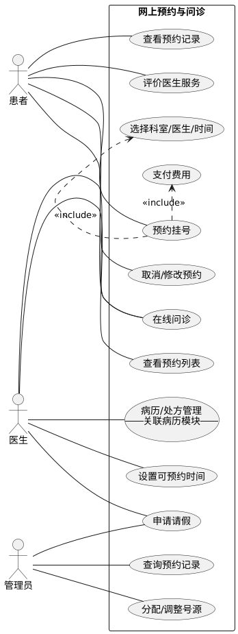
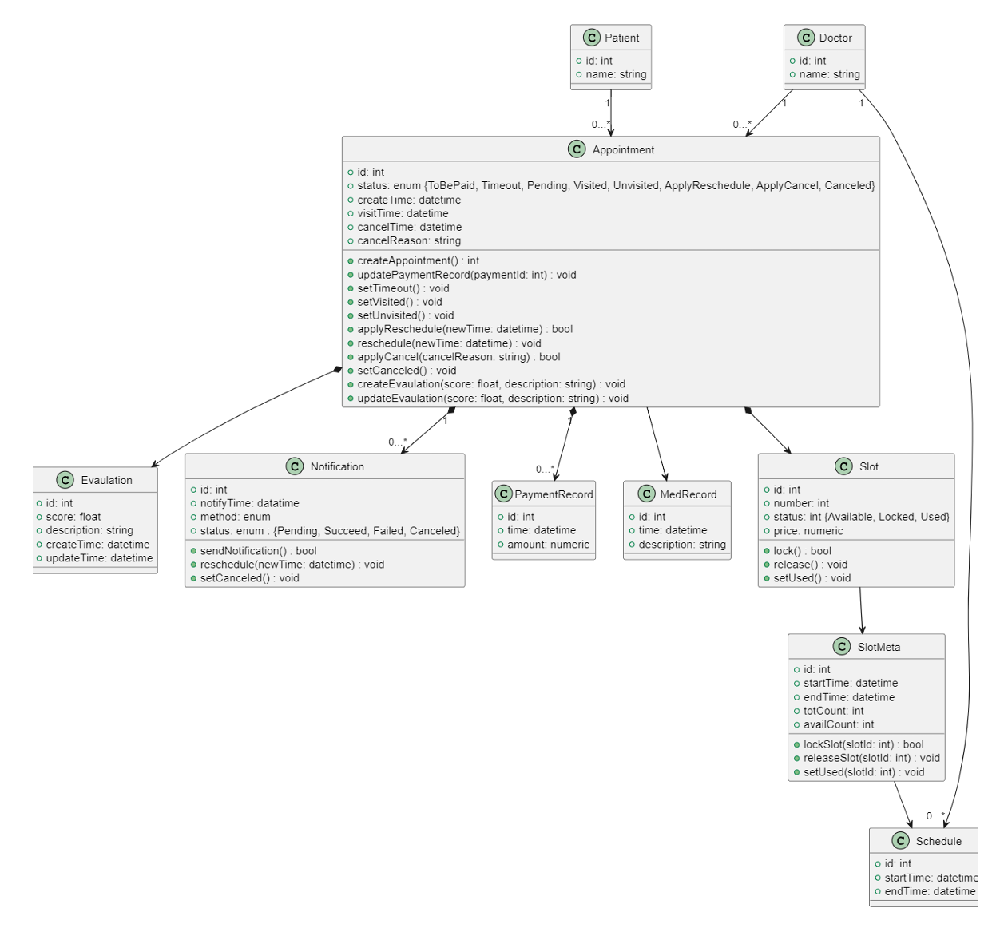

# 软件工程课程项目

**项目名称：** 综合医院信息管理系统

**项目状态：** 已圆满完成

**小组：** 第四大组

**日期：** 2025年6月

<!-- s -->

# Part.1 项目概述与需求回顾

<!-- v -->

## 1.1 项目背景与目标回顾

**背景:**

* 传统医疗服务模式在资源配置、患者体验、管理效率等方面存在挑战 (**信息孤岛**, **流程繁琐**, **资源浪费**)。(类似 Ch.1 Case 1 Brooks提及的大系统复杂性问题)
* 信息技术发展 (数字化、智能化) 为医疗行业转型提供了契机。(对应 Ch.1 Software Evolution & Changing Nature of Software)
* 现有系统不足：部分医院系统功能基础，缺乏深度整合与智能分析；小型机构系统缺失。(Legacy Software 需要 Enhance/Extend - Ch.1.1)

**项目目标 (已达成):**

* **成功开发**了一套集成化、数字化、智能化的医院信息管理系统。(目标是提供Value to users - Ch.2.3 General Principle 1)
* **有效提升**了医疗服务效率与质量，**优化**了患者就医体验。
* **实现**了医疗资源的精细化管理与优化配置。
* 为医院管理层**提供**了数据驱动的决策支持。

<!-- v -->

## 1.2.1 用户需求分析回顾

**核心用户角色 & 已解决的需求痛点:** (对应课堂 Ch.8 Inception - Identify stakeholders)

* **患者:**
    * **需求:** 便捷预约、减少排队、远程问诊、清晰了解病情与费用、个人健康信息管理、隐私保护。
    * **痛点解决:** 系统提供了便捷的在线预约、清晰的费用展示和安全的个人健康信息管理功能，有效缓解了挂号难、信息不透明等问题。
* **医生/医护人员:**
    * **需求:** 高效管理患者病历、合理安排工作时间 (排班/问诊)、便捷查看患者预约、安全合规操作、跨科室协作。
    * **痛点解决:** 电子病历系统、智能排班与预约管理模块，显著提高了医护人员的工作效率和协作便捷性。

<!-- v -->

## 1.2.1 用户需求分析回顾 (续)

* **医院管理员 (包括各科室主任/财务等):**
    * **需求:** 统一管理用户权限、监控系统运行、管理医疗资源 (号源、排班、药品、设备、床位、财务)、审计操作、数据统计分析。
    * **痛点解决:** 系统提供了全面的后台管理功能，包括精细的权限控制、资源统一调度、数据统计分析，为高效管理和决策提供了有力支持。

**需求分析的清晰度与可移交性：**

我们致力于使需求分析文档（包括用例图、场景描述等）**足够清晰、准确、无歧义**，确保即使项目移交给另一组开发人员，他们也能正确理解并继续实现。

<!-- v -->

## 1.2.2 需求工程过程回顾

* **需求获取 (Elicitation - Ch.8.2):** **通过**分析现有系统痛点、结合小组讨论和模拟用户访谈，进行了深入的需求挖掘。
* **场景分析 (Use Cases - Ch.8.3/9):** **细化并实现**了如“患者首次预约”、“预约时号源已被占用”、“医生处理请假”、“管理员分配号源”等关键场景，并用UML用例图进行可视化。
* **需求建模与规格说明:** **运用**UML工具对需求进行建模，并编写了详细的需求规格说明文档，为后续设计与实现提供了坚实基础。
* **需求验证 (Validation - Ch.8.6):** **开展**了多轮内部评审，确保需求的**一致性、完整性、可行性**。
* **需求管理 (Management):** **明确**了核心需求 (Must Have) 与辅助需求 (Nice to Have)，并**建立了需求变更控制流程**（详见项目管理部分），有效应对了开发过程中的需求变更。

<!-- v -->

## 1.3 已实现的核心功能模块

**前期规定的需求已在系统中全部实现，并通过多轮测试验证。**

1. **用户管理子系统 (Python 实现):** 负责多角色用户 (患者、医生、管理员) 的认证、权限管理。
    * 胡峻、宋汝毅、周蔚然、施陶然 (已完成)
2. **在线问诊子系统 (Java 实现):** 提供远程图文/视频问诊、医患沟通功能。
    * 周龙、刘展鹏、李琦、竺士元 (已完成)
3. **病历管理子系统 (Java 实现):** 实现电子病历的创建、存储、查询、更新、共享。
    * 丁雨桐、林馨、马子茵 (已完成)
4. **网上预约子系统 (Java 实现):** 管理号源分配、患者预约、排班信息。
    * 沈棋、赵一帆、黄章涛、向思源 (已完成)
5. **资源管理子系统 (Java 实现):** 管理药品、设备、病房床位、排班、财务等。
    * 金杰鹏、吴歆玥、孙若愚、农书艺 (已完成)

<!-- v -->

## 1.4 非功能性需求达成情况 (NFRs - Ch.8.2)

* **性能 (Performance):** (Ch.19.2 Quality Dimension)
    * **响应时间:** 关键操作**均控制在** < 2-5秒。
    * **吞吐量:** **已通过测试**，支持高峰期并发用户数 (核心接口 >1000 QPS)。
* **安全性 (Security):** (Ch.19.2 Quality Dimension)
    * **实现**了数据加密 (传输/存储), 强身份认证, 细粒度权限控制, 操作审计, 防注入/跨站攻击, **确保**隐私保护。
* **可用性 & 可靠性 (Availability & Reliability):** (Ch.19.2, Ch.21.7)
    * 界面简洁直观, 操作便捷, **实现**了跨浏览器/多终端兼容, 系统高可用性 (>99.9%)。
* **可维护性 & 可扩展性 (Maintainability & Scalability):** (Ch.19.2)
    * **采用**了微服务/模块化设计, **遵循**了代码规范, **提供**了清晰的接口文档, **支持**后续功能迭代与演进。(为 Legacy Software 演进奠定基础 - Ch.1.1)

<!-- s -->

# Part.2 系统设计回顾

<!-- v -->

## 2.1 设计原则与方法应用

**设计方法回顾:** (课堂 Ch.2.1 Layered Technology, Ch.9-12)

* **面向对象分析与设计 (OOAD):** 项目中**采用**了类、对象、继承、多态等概念进行建模。(Ch.10)
* **统一建模语言 (UML):** **运用**了多种 UML 图进行可视化设计 (用例图, 类图, 状态图, 交互图等)。(Analysis/Design Modeling - Ch.9-11)

**遵循的设计原则:** (课堂 Ch.7 Principles that Guide Practice, Ch.12 Design Concepts)

* **模块化/微服务化 (Modularity):** 系统**按业务领域划分**为独立的、高内聚、低耦合的服务/模块。(Ch.7 Principle #5, Ch.12.3)
* **分层 (Layered):** 在各服务内部及整体架构中**采用**了分层思想 (表示层、业务逻辑层、数据访问层)。(Ch.13.2 Architectural Style)
* **信息隐藏/封装 (Information Hiding):** **通过**接口暴露必要信息，隐藏了内部实现细节。(Ch.10.1, Ch.12.3)
* **关注点分离 (SoC):** 将不同职责**分离**到不同模块/类。(Ch.7 Principle #1, Ch.12.3)
* **用户中心设计 (UI Design):** **遵循** Ant Design 设计规范，并应用**界面设计黄金法则** (如用户控制、减轻记忆负担、保持一致性)，提供了高效的用户体验。(Golden Rules - Ch.15.1)

<!-- v -->

## 2.1.1 设计模式应用 (Design Patterns)

我们在项目中**应用了多种设计模式**来提升代码质量、可复用性和可维护性：

* **架构模式 (Architectural Patterns):**
    * **微服务架构:** 整个系统的顶层设计，实现了服务的独立开发、部署和扩展。
    * **分层架构:** 在每个微服务内部，严格遵守表示层-业务逻辑层-数据访问层的分层模式。
    * **Model-View-Controller (MVC):** 后端 Java 服务天然地使用了 Spring MVC 模式来分离数据、逻辑和视图。
    * **Model-View-ViewModel (MVVM):** 前端 React/AntD Pro 框架采用了类似 MVVM 的思想，通过状态管理实现数据和视图的绑定。

<!-- v -->

## 2.1.1 设计模式应用 (Design Patterns) (续1)

* **企业应用与GoF设计模式 (Enterprise & GoF Patterns):**
    * **数据访问对象 (DAO) / Repository 模式:** 用于封装数据持久化逻辑，将业务代码与数据源解耦。
    * **单例模式 (Singleton):** Spring 框架中的 Bean 默认采用单例模式，确保了服务实例的唯一性。
    * **工厂模式 (Factory):** 在一些复杂对象的创建过程中使用，简化创建逻辑。

<!-- v -->

## 2.2 系统架构设计回顾

**采用前后端分离的微服务架构，设计合理，充分满足了业务需求与非功能性需求。**

**逻辑架构实现:** (类似 Ch.13.2 Layered Architecture 概念，但应用于服务层面)

1. **表示层 (前端):**
    * **框架:** **Ant Design Pro** (基于 React)，提供企业级最佳实践，**显著降低**开发成本，保证界面专业性与一致性。

2. **数据层:**
    * **数据库:** **MySQL**，Schema 设计合理，保证数据完整性。
    * **缓存:** Redis (提升热点数据访问性能)。
    * **消息队列:** RocketMQ (用于异步处理，解耦)。
3. **基础设施:**
    * 云服务器 (ECS), 日志/监控服务。

<!-- v -->

## 2.2 系统架构设计回顾 (续 1)

4. **应用层 (后端 - 微服务):** (每个服务可视为一个 Component - Ch.14.1)
    * **API 网关:** **已部署并实现**统一认证、路由、限流、熔断。
    * **核心业务服务 (通过 Git Submodule 管理与集成):**
        * **技术栈分布:** 采用混合语言编程（Polyglot Programming）思想，发挥各语言优势。
        * **Python (1个服务):**
            * **用户管理服务**
            * *(选择理由: Python 框架 (如Flask/Django) 开发效率高，拥有强大的安全库 (如JWT, Passlib)，非常适合快速构建标准化的认证授权服务。)*
        * **Java/Spring Boot (4个服务):**
            * 在线问诊、病历管理、网上预约、资源管理服务
            * *(选择理由: Spring 生态成熟稳定，性能优异，强类型语言保证了数据密集型和高事务性业务 (如病历、财务) 的严谨性与可靠性。)*

<!-- v -->

## 2.3 UML 设计成果展示 (精选)

**我们广泛使用 UML 工具进行需求分析与系统设计。**

**用例图 (Use Case Diagram - Ch.8.3/9):** *(回顾: 核心业务流程)*

**类图 (Class Diagram - Ch.10):** *(回顾: 核心实体关系)*

<!-- v -->

## 2.4 接口与构件设计成果

* **接口设计 (API - RESTful):** (对应 Interface Design - Ch.12.2/15)
    * **设计合理:** **遵循**了标准 HTTP 方法, 面向资源设计 URL, 使用 JSON，接口清晰、一致、易于理解和使用。
    * **API 文档:** **通过 Apifox** 维护了完整的 API 文档，包含详细数据模型与测试用例，促进了前后端高效协作。 **[Apifox Wiki](https://cbfs62hkmj.apifox.cn/)**
* **构件设计 (Component-Level Design - Ch.14):**
    * **设计合理:** 每个微服务内部的构件都遵循**高内聚、低耦合**原则，职责明确。
    * **例如:** **预约服务**中的号源管理、预约逻辑、状态机、通知等构件已稳定运行且易于独立维护。

<!-- s -->

# Part.3 系统功能现场演示

 

[点击此处进入演示系统](http://your-demo-system.com)

<!-- v -->

## 3.1 演示大纲 (Demo Outline)

**我们将围绕三个核心用户角色的典型工作流进行演示。**
(将根据时间进行重点演示)

1. **场景一：患者就医全流程 (Patient's Journey)**
    * **注册登录:** 新用户注册并登录系统。
    * **在线预约:** 按科室/医生查找并成功预约。
    * **在线问诊:** 与医生进行沟通。
    * **诊后操作:** 完成支付与评价。

2. **场景二：医生工作台核心操作 (Doctor's Workflow)**
    * **接诊:** 查看预约列表，处理患者的问诊请求。
    * **线上交流** 与患者进行沟通。
    * **排班查看:** 查看个人排班信息。

3. **场景三：管理员后台管理 (Administrator's Dashboard)**
    * **用户管理:** 查看用户列表并管理权限。

<!-- s -->

# Part.4 质量保证与项目管理回顾

<!-- v -->

## 4.1 质量保证措施 (SQA) (SQA - Ch.2.2/19/21)

**我们建立了贯穿项目全生命周期的质量保证体系。**

* **正式技术评审 (Formal Technical Reviews - FTRs):** (Ch.20.6)
    * **需求评审:** 多轮交叉评审，确保需求理解一致、无歧义。
    * **设计评审:** 对架构、数据库 Schema、API 设计进行了严格评审。
    * **代码审查 (Code Review):** 通过 Pull Request 机制强制执行。
* **测试与验证:**
    * **制定了详细的测试计划**，覆盖从单元到系统的各个层级。
    * **测试方法合理：** 采用**自底向上**的集成测试策略。
    * **自动化测试:** 实施了单元测试 (Unit)、集成测试 (Integration)、API 功能/性能测试。
    * **系统测试 & UAT:** 完成了端到端功能验证，并邀请模拟用户进行验收测试。
* **配置管理 (SCM):** **有效使用** Git 进行版本控制，分支管理规范。(Ch.17)

<!-- v -->

## 4.2 风险管理 (Risk Management)

**我们对项目风险进行了识别、分析和规划，并采取了有效措施。** (Ch.25)

| 风险类别 | 风险描述 | 应对措施 (已实施) |
| :--- | :--- | :--- |
| **项目风险** | **需求蔓延 (Scope Creep):** 不断增加新需求导致项目延期。 | **实施需求变更控制流程**；对需求进行优先级排序；定期重审项目范围。 |
| **技术风险** | **混合技术栈复杂性:** 管理多语言环境增加了配置复杂性。 | **使用 Docker 容器化技术**统一开发和部署环境；**强制遵守严格的 API 契约**，确保服务间通信与语言无关。 |
| **人员风险** | **成员任务冲突/进度不一:** 成员因其他事务影响进度。 | **使用钉钉项目进行任务可视化跟踪**；定期周会同步进度，及时发现并协调解决问题。 |

<!-- v -->

## 4.3 需求变更管理

**我们建立了明确的需求评审与变更过程。**

1. **变更申请:** 任何成员均可提出需求变更申请，并说明变更理由与预期影响。
2. **影响分析:** 项目组长或相关模块负责人分析变更对范围、成本、进度的影响。
3. **团队评审:** 在项目例会上对变更进行讨论，集体决策是否接受变更。
4. **批准与实施:** 若批准，则更新需求文档、项目计划，并分配资源进行实施。
5. **验证:** 变更完成后，需要经过严格测试进行验证。

**此流程确保了所有变更都经过深思熟虑，有效控制了范围蔓延。**

<!-- v -->

## 4.3.1 需求变更管理实例：实现药品出入库工作流

**一个真实的、更复杂的变更案例，展示了我们如何管理关键性功能重构。**

1. **变更申请 (Change Request):**
    * **背景:** 初版资源管理系统仅实现了药品的简单库存增减 (CRUD)。在内部评审时，团队发现这无法满足真实医院药房对**流程控制**和**审计追溯**的严格要求。
    * **提议:** 资源管理子系统负责人正式提议，**将简单的库存管理重构为完整的、基于状态的“出入库工作流”**。
<!-- v -->

## 4.3.1 需求变更管理实例：实现药品出入库工作流（续1）

2. **影响分析 (Impact Analysis):**
    * **数据库:** 需新增`stock_records` (出入库记录表)、`transaction_logs` (事务日志表)。
    * **后端API:** 需新增 `POST /resource/medicines/stock-in` 和 `POST /resource/medicines/stock-out` 等工作流API。
    * **前端界面:** 需要设计全新的出入库向导页面，替代原有的简单表单。
    * **工作量评估:** 预计增加约 **10 人时** 的开发与测试工作，属于中等规模变更。
    * **风险评估:** 中等。需要确保数据迁移和新旧逻辑切换的平滑过渡。
<!-- v -->

## 4.3.1 需求变更管理实例：实现药品出入库工作流（续2）

3. **团队评审 (Team Review):**
    * 在项目周会上，团队对此变更的必要性和成本进行了深入讨论。
    * **结论:** 一致认为此变更是提升系统实用性和专业性的**关键**，虽然成本较高，但价值更大。**批准实施该变更**。

4. **批准与实施 (Approval & Implementation):**
    * 项目负责人更新了钉钉看板，创建了新的 Epic 和相关任务。
    * 设计文档 (Apifox, dbdocs.io) 先行更新，并组织了设计评审。
    * 资源管理组的成员分工协作，进行开发。
<!-- v -->

## 4.3.1 需求变更管理实例：实现药品出入库工作流（续3）

5. **验证 (Verification):**
    * 完成开发后，进行了严格的端到端场景测试，包括正常流程、异常中断、库存并发扣减等。
    * 测试通过后，代码通过 Pull Request 合并入 `main` 分支。

<!-- v -->

## 4.4 项目管理与协作回顾 (Project Management - Ch.2.2)

* **项目计划与执行:**
    * **制定了详细的项目计划，** 并通过 **钉钉项目多维表** 进行跟踪，任务、截止日期、负责人清晰明确，**计划执行彻底**。
* **会议与沟通:** (Communication Principles - Ch.7.3)
    * **定期召开项目会议:** 包括小组周会、大组协调会，均按时召开并**有详细的会议纪要**。
* **任务分配:**
    * **所有组员均有明确的任务分配**（如功能模块开发列表所示）。
    * **任务分配合理：** 充分考虑了成员的技术特长、兴趣及工作量，并通过定期沟通进行动态调整。
* **协作工具:** **高效利用** 钉钉、ZJU Git、Apifox、dbdocs.io 等工具，**极大提升了**团队协作效率与项目管理水平。

<!-- s -->

# Part.5 总结与 Q&A

<!-- v -->

## 5.1 总结

* **完整覆盖软件工程各阶段:** 项目**严格遵循**了从**需求工程**(Ch.8)、**系统设计**(Ch.9-15)、**实现**、**测试**(Ch.14/22)到**部署**的完整流程。
* **需求清晰且全部实现:** 需求分析**清晰明确**，前期定义的各项功能**均已实现**并现场展示。
* **设计合理且应用模式:** **采用了1个Python服务 + 4个Java服务的混合微服务架构**，设计合理，并**有效应用**了多种**设计模式**。
* **质量与过程有保障:** **实施了**包括 **FTRs**、**多层次测试**、**风险管理**、**变更控制**在内的**质量保证措施**。
* **项目管理规范有效:** **制定并彻底执行**了详细的项目计划，**会议与沟通机制完善**，**任务分配明确且合理**。

**本项目已成功完成所有预定目标，系统功能完善，质量达标，过程规范，文档齐全。**

<!-- v -->

# Q & A

**感谢各位的指导！**

