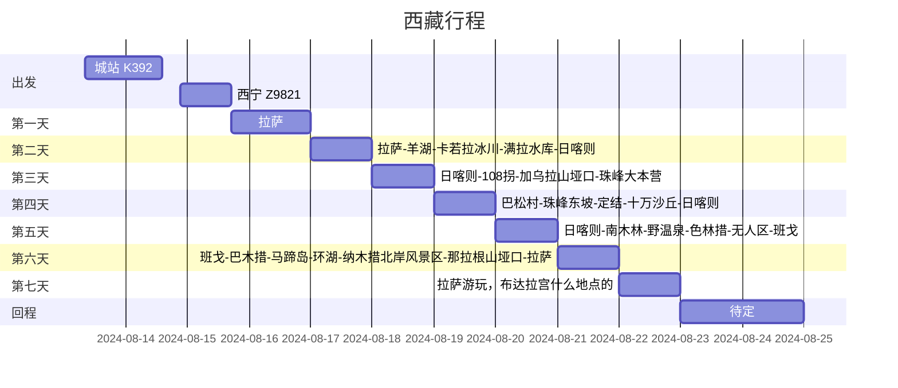
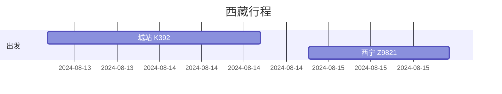
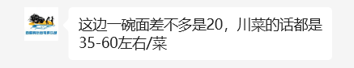

# 西藏之行！

By [@ColdInk](https://github.com/JiepengLab)

<!-- s -->

# 准备什么东西？

<!-- v -->

## 物资准备！

- 行李箱(x)
- 证件类：身份证、学生证、边防证、驾照——但不建议自驾，第一次去，身体状况和路况都很复杂
- 药物：角鲨烯/红景天（预防高反，红景天提前一两周吃，角鲨烯提前3-5天——网上那些高反神💊 大部分都是营销，布洛芬缓解疼痛，葡萄糖补充能量，吸氧，减少运动才是硬道理。），感冒药，高原安（西藏有很多，不用提前买），葡萄糖饮品，布洛芬（高海拔头疼吃），晕车？，红霉素（晚上碎觉很干容易鼻子干燥出血////看住什么酒店），眼药水
- 四季着装、冲锋衣、防晒手套、长檐帽子口罩墨镜
- 保湿（干燥风大）、唇膏、防晒霜（喷雾型的好像上不了高铁）
- 手机、充电宝、充电器、耳机
- 50块现金、吃的吃的、桌游桌游
<!-- v -->

## 高原反应

- 第一天不要洗头洗澡，不要跑跳
- 多喝葡萄糖水
- 身体不适及时说出，然后立刻去医院（手机保持畅通非静音，晚上有需要随时联系）
- 前两周少做有氧运动，好好作息

<!-- s -->

# 流程安排

<!-- v -->

## 总流程

<!-- v -->

## 出发

K392: 蜿蜒的，曲折的铁路真的能让你窥见小半个中国的影子。你可以看到炊烟袅袅的陌上水田人家，在云里在雾中，温文尔雅如同娴静花照水的江南女子，也可以看见，陕北陇西一望无际的，辽阔无垠如同棕色的，黄褐色的海，那风浪中静止定格的海。在往前走，能窥见更高的山，你会穿插经过汉朝民歌里说的“亡我祁连山，使我六畜无潘息，失我焉支山，使我妇女无颜色的”的河西走廊，会穿插过祁连山脉，会到达君不见，青海头，古来白骨无人收的茫茫无人区。

Z9821: 最美进藏列车！超多好看的

<!-- v -->

## 游玩

- 价格是~~3880元/人~~~~（然后jjp以学生优惠为由砍掉了140米——记得带学生证！）~~，3740元/人
- 4人/车（越野）车型是：坦克300，或者丰田越野及同级
- 费用包含车费，住宿，景点门票，边防证，百万旅游保险，氧气（不限量）无人机，单反，不含吃饭
- 住宿（四个晚上）：
    - [日喀则卓晟酒店](https://hotels.ctrip.com/hotels/78998869.html)或者[唐卡酒店](https://hotels.ctrip.com/hotels/480546.html)
    - [珠峰豪庭供氧酒店](https://hotels.ctrip.com/hotels/78884224.html)或者[且听风吟供氧客栈](https://hotels.ctrip.com/hotels/110421854.html)
    - [日喀则卓晟酒店](https://hotels.ctrip.com/hotels/78998869.html)或者[唐卡酒店](https://hotels.ctrip.com/hotels/480546.html)
    - [班戈鑫津大酒店](https://hotels.ctrip.com/hotels/62413902.html)或者[班戈大酒店](https://hotels.ctrip.com/hotels/60102553.html)

<!-- v -->

## 住宿

- 15、16号晚：拉萨
- 17号晚：日喀则
- 18号晚：珠峰大本营
- 19号晚：日喀则
- 20号晚：班戈
- 21、22号晚：拉萨

<!-- v -->

## 人均预算

- 交通：火车票$\approx 960+ 800=1760\approx 1800$
- 住宿：四个晚上的拉萨酒店
- 五天出去玩：3740元
- 吃饭： $\leq 800$
- 布达拉宫：200元
<!-- s -->

# 注意点

<!-- v -->

## 民俗习惯

<!-- v -->
