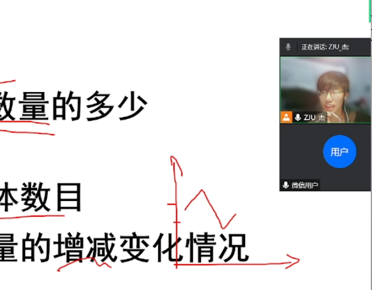

## 经验分享

|章节 ||标题 |
|:--:|:--:|:--:|
|1|···|自我介绍|
|2.1|···|信息收集与生涯规划|
|2.2|···|学习方式与笔记系统|
|3|···|提问与总结|

网站地址 [slide.jiepeng.tech/share240322](https://slide.jiepeng.tech/share240322)

分享人：金杰鹏，[联系方式](#/0/2)

怎么使用这个 Slide ? 按 ↓ 方向键或 下滑 查看说明

<!-- v -->

## PC 端

通过  点击 / 空格 来选择下一页

使用 h/← j/↓ k/↑ l/→  或者点击右下角的方向盘 来进行上下左右切换，直接点击页面底部的进度条也可以实现页面跳转。

按下 f 来全屏显示，按下 Esc 退出。

按下 o 进入总览视图，可以利用方向键进行移动，回车或点击进行选择。需要注意，这里显示的内容和实际展示的页面内容在布局上存在差异。

## 移动端

基本的点击操作是一样的。带有方向的滑动可以对应方向键功能。

<!-- v -->

## 联系方式

 
#### 碎碎念

由于这次分享针对的大多是不同专业的同学，所以我能讲的更多的是一些共性的经验。如果想跟我交流更多问题的话，欢迎加我微信

> WECHAT: a1978264748

<!-- s -->

# 自我介绍

<!-- v -->

## 关于我

金杰鹏，大二在读，累积10余门满绩，29门4.5及以上

· 毕业于浙江省杭州高级中学，进入蓝田学园·工科试验班2205

大一上

· 31 学分，均绩 4.73/5.0，工试大类 2/713

· 2022 “创客启程” 大赛 第二名

· 至美公益 线上支教

<!-- v -->

## 关于我

大一下 

· 选拔预转入竺可桢学院混合班

· 选拔进入竺可桢学院工程教育高级班

· 2023年 浙江省大学生高等数学竞赛 二等奖

· 2022-2023学年 学业优秀标兵

· 2022-2023学年 创新创业标兵

· 2022-2023学年 优秀学生

· 2022-2023学年 校设奖学金 浙江大学一等奖学金

<!-- v -->

大二上 

· 工试 2302 学长组

· 正式转入竺可桢学院混合班

· 转入计算机科学与技术专业

· 竺院 『程序设计和算法基础』 辅学学长

· 毕马威ESG案例分析大赛(浙江大学赛区)   第一名

· 第十五届全国大学生数学竞赛浙江赛区初赛    非数A类 一等奖

· 选了[43.5学分](https://www.cc98.org/topic/5805806)...

<!-- s -->

# 信息收集与生涯规划

· 学长，我要转专业

· 你了解另一个专业吗？

· 不了解...

> 没有信息收集，何谈生涯规划？！

<!-- v -->

## 信息收集与生涯规划

· 专业确定：本专业与目标专业的实际情况（找该专业前辈聊），转专业细则（课程修读要求......）

· 推免/跨保：本专业政策（加分项、课程占比...）、流程（夏令营、九推、联系导师、预推免...）

· 考研/跨考：考研科目、流程...

· 出国留学：语言要求（托福/雅思/GRE）、暑研、套磁...

· 本科就业：企业有什么岗位，面经...

· ...

> 当然，随着自己的成长，每个选择的意向程度都会有所改变。但是，请务必抽一些时间对心选的方向做出了解，不要单单为抽象的概念努力

<!-- v -->

## 如何获取这些信息呢？

普遍有效：问学长学姐、[CC98](https://www.cc98.org/)，善用搜索（Bing...）

在专业了解上，可以写邮件问各院系的老师（不必害怕，老师们都很热情的！）

对于推免：最好先拿到本年度的保研政策（在各学院院网上，但公示期后会删除，可以去找本专业学长们要）

留学：强推各学院的[飞跃手册](https://www.cc98.org/topic/4859952)，其中有关于前辈们留学的考虑、如何准备留学的办法等等

除此之外，相信你在自行搜索后，肯定能收获更多。

<!-- v -->

## 信息收集 Appendix

求是潮：Notify小程序

###### 电子书

[Anna’s Archive](https://annas-archive.org/)

[Z-Library](https://zh.zlibrary-global.se/)

###### 推荐阅读

[【本科四年回忆录】Hey Kong! Can you hear me? (Tag：本科规划、转专业/保研/申请）](https://www.cc98.org/topic/5353745)

<!-- s -->

# 学习方式与笔记系统

<!-- v -->

## 学习方式

<iframe src="//player.bilibili.com/player.html?aid=934978627&bvid=BV1XM4y1c7Jp&cid=464171873&p=1&autoplay=0" scrolling="no" border="0" frameborder="no" framespacing="0" allowfullscreen="true"  autoplay="false"> </iframe>

大家可能已经经历过[【考试周破防】](https://www.bilibili.com/video/BV1XM4y1c7Jp)了x，大学的学习和高中还是完全不一样的。

最应做的是，从 [CC98](https://www.cc98.org/)、朵朵上找到前辈们的经验及其笔记。我们与前辈同为学者，这之间知识的传承是最可贵的。

<!-- v -->

## 学习方式

做好代做事项的备忘录。毕竟大学提交作业的时间往往都较久，期间会有各种各样的事情，很容易忘掉DDL...

在“芜杂”的课程中，做出一份好的笔记供自己复习整理是很必要的。

<!-- v -->

## 笔记系统

本人在高中基本不做笔记，在大学越学越觉笔记的重要性。在大学中，笔记体系发生如下变化：

$${买活页本，纸质笔记}$$

没找着大一当时做的微积分笔记,xs

$${平板，电子笔记}$$

[$${Markdown，电子笔记}$$](https://note.jiepeng.tech/)

<!-- v -->

## 为什么我选择用 Markdown 做笔记？

· 不会丢失：比纸质笔记更加安全

· 简洁：不用考虑排版，专注于内容（而且排版也很好看）

· 方便(1)：有需求从电子书拷贝内容时，直接粘贴即可（然后你可以根据自己的话语重新组织）

· 方便(2)：当你问gpt时，也可以直接把问题和答案复制到你的笔记中进行整理

· 方便(3)：可以直接导出为 pdf，方便打印，传阅。

· 清晰：可以根据自己的需求进行目录的整理，方便查找

> 当然，适合自己的笔记系统才是最好的。

<!-- v -->

## 笔记系统 Appendix

Markdown 是个非常简单的语言，看[官方教程](https://markdown.com.cn/basic-syntax/blockquotes.html)不出一小时就能学会

我是用 [Vscode + markdown 插件](https://zhuanlan.zhihu.com/p/56943330) 来进行 Markdown 文档的撰写，实时渲染，非常好用。当有需求时，通过 Typora 进行导出。（Typora 模板丰富，非常好看）

据说 Obsidian 也很好用，但我还没用过...

<!-- v -->

## 笔记系统 Appendix

如何构建类似 [JiepengLab](https://note.jiepeng.tech/) 的网站？

网站采用 [Material for MkDocs](https://squidfunk.github.io/mkdocs-material/) + Github Page 部署，喜欢折腾的可以去了解一下。

<!-- s -->

# 提问与总结

